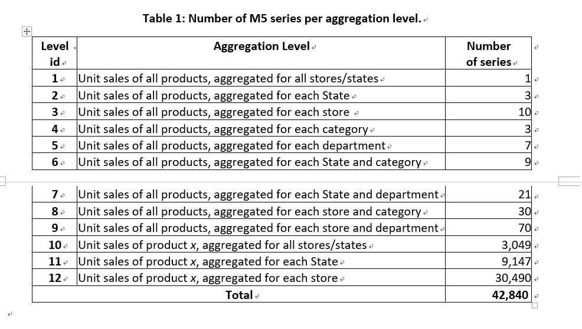

# Kaggle: M5_Forecasting_Accuracy

Author: Xin Pan

Date: 2020.06.12

---

## 比赛概况

使用沃尔玛的销售数据，来预测接下来28天的日销售金额以及不确定性的估计。这些数据涵盖了美国三个州（加利福尼亚州、德克萨斯州和威斯康星州）的门店，包括商品级别（level）、部门、产品类别和门店详细信息。此外，它还具有解释变量，如价格、促销（promotions）、星期几和特殊事件。

## m5数据分析

### 注释

1. (E)表示这列在处理的时候使用LabelEncoder重新打标签

### calendar.csv

数据一共1969天。包含如下的这些列：

| date                 | wm_yr_wk                | weekday               | wday                 | month              | year               | d                                    |
| -------------------- | ----------------------- | --------------------- | -------------------- | ------------------ | ------------------ | ------------------------------------ |
| 日期(比如2020-6-17)  | 一年52州（11101-11621） | 周几（monday--sunday) | 周几（1-7)           | 1-12               | 2011这样的数字     | d_1-d_1969(2011-1-29开始），一直累加 |
| event_name_1(E)      | event_type_1(E)         | event_name_2(E)       | event_type_2(E)      | snap_CA            | snap_TX            | snap_WI                              |
| 节日名字（没有为空） | 节日类型（没有为空）    | 节日名字（没有为空）  | 节日类型（没有为空） | 0/1（可以/不可以） | 0/1（可以/不可以） | 0/1（可以/不可以）                   |

两组特殊节日名称和节日的种类，以及snap_XXX其中的XXX代表CA，TX，WI。是说这三个地点的商店是否允许购买带有`snap`标签的商品。

### sales_train_evaluation.csv

保存了历史每天每个产品的每天的销售数据从[d_1,d_1941]。也就是[d_1942,d_1969]一共28天是要预测的。id是30490个，item_id是3049个。包含如下这些列：

| id   | item_id(E) | dept_id(E) | cat_id(E) | store_id(E) | state_id(E) |
| ---- | ------- | ------- | -------- | -------- | -------- |
| 由很多字段组成（item_id+store_id+partion） | 商品id | 7种 | 3种，Food最多，其次是Household，最少的是Hobbies | 10种 | 3个 |
| d_1  | d_2     | ......  | d_d_1941 |||
| 销售量，整形，没有卖就是0 | 销售量，整形，没有卖就是0 | ...... | 销售量，整形，没有卖就是0 |||

> Instead of having a single competition to estimate both the point forecasts and the uncertainty distribution, there will be **two** parallel tracks using the **same** dataset, the first requiring 28 days ahead point forecasts and the second 28 days ahead probabilistic forecasts for the median and four prediction intervals (50%, 67%, 95%, and 99%).

`item_id`和`id`之间存在一个10倍的关系，因为什么呢，CA有4个仓库，TX有3个仓库，WI（威斯康星州）有3个仓库。这个数据表的一行，表示一个商品在一个store的1941天的销售情况。

### sales_train_validation.csv

和上边文件差不多，但是日期范围是[d_1,d_1913]。id是30490个，item_id是3049个。

### sample_submission.csv

预测60980个id在28天的销售情况。包含如下这些列：

| id                                                | F1   | ....... | F28  |      |
| ------------------------------------------------- | ---- | ------- | ---- | ---- |
| 包括evaluation和validation结尾的id一共和30490*2个 |      |         |      |      |

### sell_prices.csv

每个商店里每个商品的每周的销售价格。包含如下这些列：

| store_id(E)                     | item_id(E)                      | wm_yr_wk                 | sell_price      |      |
| ------------------------------- | ------------------------------- | ------------------------ | --------------- | ---- |
| `sales_train_*.csv`里边相同的列 | `sales_train_*.csv`里边相同的列 | `calendar.csv`中的这个列 | 销售价格，float |      |

6841121行。

## TODO：

1. 这里还需要明白到底预测的是什么？

   A: 30490个商品在28天的销售情况。

2. 训练的3个fold，每个差了28天。这个是一个trick我认为，那么我是否可可以在多增加几个这样的fold?

## Reference

1. [kaggle M5 homepage](https://www.kaggle.com/c/m5-forecasting-accuracy)

2. [m5数据介绍](https://mofc.unic.ac.cy/m5-competition/)