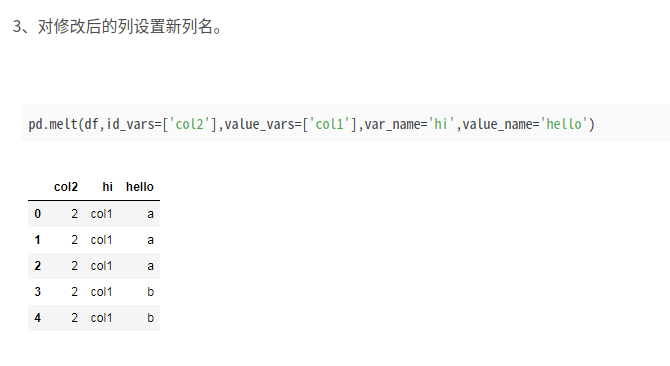
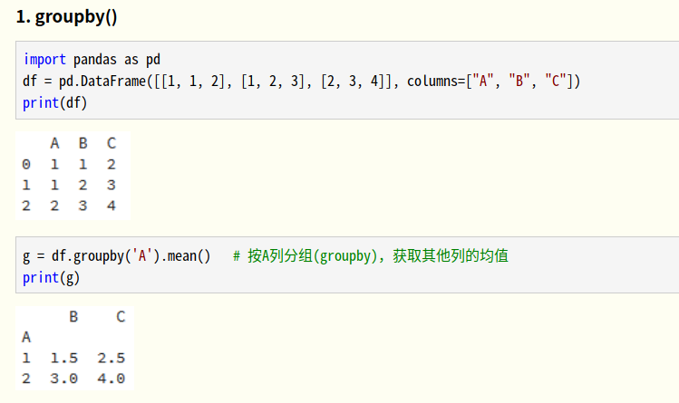

# Kaggle: M5_Forecasting_Accuracy学习到的东西

Author: Xin Pan

Date: 2020.06.12

----

## m5 baseline代码分析

1. import gc

python 的垃圾回收模块garbage collector。使用起来很简单，import gc .........gc.collect()就可以了。

[参考](https://www.jianshu.com/p/b6a20c812ce4)


2. import warnings

 warnings.filterwarnings("ignore")可以忽略当前程序中出现的warnings。这些东西可能当前看起来很碍眼。

[参考](https://blog.csdn.net/u013544265/article/details/28617527)


3. from pandas.plotting import register_matplotlib_converters

也就是说这个命令把pandas的格式转换到matplotlib进行实现。Register Pandas Formatters and Converters with matplotlib.

[pandas doc](https://pandas.pydata.org/pandas-docs/stable/reference/api/pandas.plotting.register_matplotlib_converters.html)


4. import seaborn

seaborn 和matplotlib并成为世界两大图像现实库。seborn基于matplotlib，比matplotlib封装更高级，做出的图统计统计效果更好。

[什么是lightgbm](https://zhuanlan.zhihu.com/p/52583923)


5. import lightgbm as lgbm

一个python上边使用的gbm库

[参考](https://zhuanlan.zhihu.com/p/52583923)


6. from sklearn.metrics import mean_squared_error

计算均方误差回归损失
格式：
sklearn.metrics.mean_squared_error(y_true, y_pred, sample_weight=None, multioutput=’uniform_average’)
参数：
y_true：真实值。[]
y_pred：预测值。
sample_weight：样本权值。
multioutput：多维输入输出，默认为’uniform_average’，计算所有元素的均方误差，返回为一个标量；也可选‘raw_values’，计算对应列的均方误差，返回一个与列数相等的一维数组。

[原文链接](https://blog.csdn.net/Dear_D/java/article/details/86136779)


7. from sklearn.preprocessing import LabelEncoder

[参考](https://blog.csdn.net/kancy110/article/details/75043202)


8. pd.set_option("display.max_columns", 500)

[参考](https://blog.csdn.net/xiongzaiabc/article/details/103023256)


9. sns.set()

[参考](https://blog.csdn.net/unixtch/article/details/78820654)


10. input_dir=f"{this_will_be_replaced}/data/dir"

python 3.6 新加入的f-string。

[f-string](https://www.cnblogs.com/insane-Mr-Li/p/12973941.html)

[定义字符串其他前缀](https://www.cnblogs.com/walo/p/10608436.html)


11. pd.read_csv()

返回的`dataframe[a][b]`假设read_csv读取的文件是[113,4]就是113行4列的数据。那么dataframe.shape=[113,4]但是dataframe["abc"]是找key="abc"的那个列

[read_csv](https://blog.csdn.net/weixin_37841694/article/details/80139479)


12. pd.DataFrame.pipe()

类似linux 中的管道|

[参考](https://pandas.pydata.org/pandas-docs/stable/reference/api/pandas.DataFrame.pipe.html)

[不同维度用不同函数](https://www.e-learn.cn/topic/3546511)


13. df.select_dtypes(include=["int"])

通过类型选择子数据框

```python
>>> df.select_dtypes(include="int")
   a
0  1
1  2
2  1
3  2
4  1
5  2
>>> df.select_dtypes(include="int").columns
Index(['a'], dtype='object')
>>> df
   a      b    c
0  1   True  1.0
1  2  False  2.0
2  1   True  1.0
3  2  False  2.0
4  1   True  1.0
5  2  False  2.0
>>> 

```

[参考](https://blog.csdn.net/xiezhen_zheng/article/details/83716267)


14. sklearn.LabelEncoder

[参考](https://blog.csdn.net/lw_power/article/details/82981122)

[官方解释](https://scikit-learn.org/stable/modules/generated/sklearn.preprocessing.LabelEncoder.html)


15. pd.Series)()

pandas使用两种方法组织数据一种是df 另一种是Series类似numpy

[参考](https://blog.csdn.net/weixin_43868107/article/details/102631717)


16. df.melt

pandas做数据df的转换melt。与之相反的操作是pivot



[参考](https://blog.csdn.net/mingkoukou/article/details/82867218)

[写的更好的一个](https://blog.csdn.net/maymay_/article/details/80039677)


17. pandas df.merge

merge: 合并数据集， 通过left， right确定连接字段，默认是两个数据集相同的字段 

[参考](https://www.cnblogs.com/lijinze-tsinghua/p/9878649.html)


18. df.groupby

分组计算



[参考](https://www.cnblogs.com/keye/p/11153427.html)

19. df.transform
20. rolling
21. skew
22. kurt
23.  pd.to_datetime()

解析时间格式

[参考](https://blog.csdn.net/Kwoky/article/details/91480035)